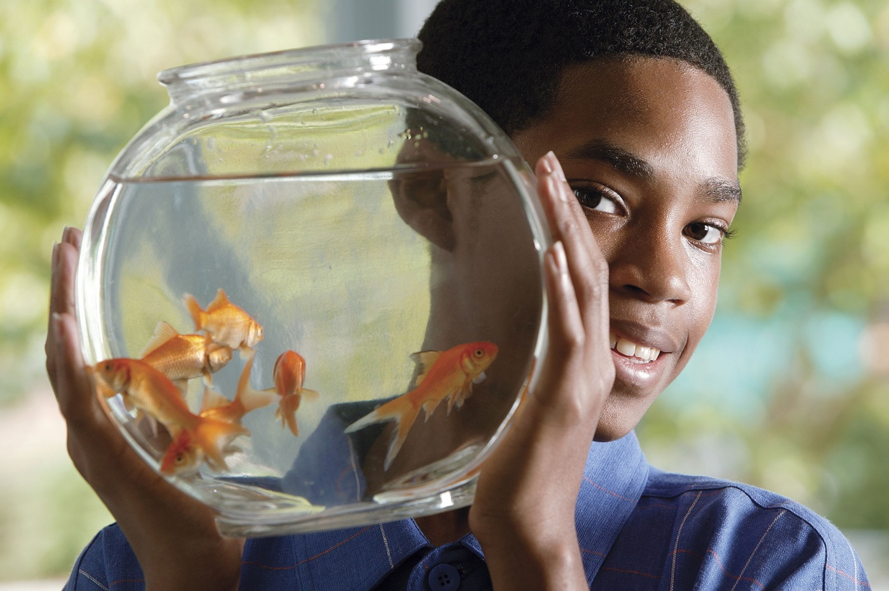

# Bootstrap4 - ペットクリニック【簡易版】

Advanced版はこちらをご覧ください
[Bootstrap4 - ペットクリニック](https://quip.com/AimHAQoH8OY6) 


テキストファイル
[Bootstrap 4 - ペットクリニック用テキスト](https://quip.com/NaPZAaZD860I) 
* * *

## Bootstrapの準備

### Boostrap 4 のQuick Start を使用する場合

CDNを利用する。
http://v4-alpha.getbootstrap.com/getting-started/introduction/#quick-start


メインCSS

```
`<link rel="stylesheet" href="https://maxcdn.bootstrapcdn.com/bootstrap/4.0.0-alpha.6/css/bootstrap.min.css" integrity="sha384-rwoIResjU2yc3z8GV/NPeZWAv56rSmLldC3R/AZzGRnGxQQKnKkoFVhFQhNUwEyJ" crossorigin="anonymous">`
```


スクリプト関連

```
`<script src="https://code.jquery.com/jquery-3.1.1.slim.min.js" integrity="sha384-A7FZj7v+d/sdmMqp/nOQwliLvUsJfDHW+k9Omg/a/EheAdgtzNs3hpfag6Ed950n" crossorigin="anonymous"></script>
<script src="https://cdnjs.cloudflare.com/ajax/libs/tether/1.4.0/js/tether.min.js" integrity="sha384-DztdAPBWPRXSA/3eYEEUWrWCy7G5KFbe8fFjk5JAIxUYHKkDx6Qin1DkWx51bBrb" crossorigin="anonymous"></script>
<script src="https://maxcdn.bootstrapcdn.com/bootstrap/4.0.0-alpha.6/js/bootstrap.min.js" integrity="sha384-vBWWzlZJ8ea9aCX4pEW3rVHjgjt7zpkNpZk+02D9phzyeVkE+jo0ieGizqPLForn" crossorigin="anonymous"></script>`
```

* jQueryは最新版 Ver. 3.x

### Starter Templateを使用する場合

http://v4-alpha.getbootstrap.com/getting-started/introduction/#starter-template

```
<!DOCTYPE html>
<html lang="**ja**">
  <head>
    <!-- Required meta tags -->
    <meta charset="utf-8">
    <meta name="viewport" content="width=device-width, initial-scale=1, shrink-to-fit=no">

    <!-- Bootstrap CSS -->
    <link rel="stylesheet" href="https://maxcdn.bootstrapcdn.com/bootstrap/4.0.0-alpha.6/css/bootstrap.min.css" integrity="sha384-rwoIResjU2yc3z8GV/NPeZWAv56rSmLldC3R/AZzGRnGxQQKnKkoFVhFQhNUwEyJ" crossorigin="anonymous">
  </head>
  <body>
    <h1>Hello, world!</h1>

    <!-- jQuery first, then Tether, then Bootstrap JS. -->
    <script src="https://code.jquery.com/jquery-3.1.1.slim.min.js" integrity="sha384-A7FZj7v+d/sdmMqp/nOQwliLvUsJfDHW+k9Omg/a/EheAdgtzNs3hpfag6Ed950n" crossorigin="anonymous"></script>
    <script src="https://cdnjs.cloudflare.com/ajax/libs/tether/1.4.0/js/tether.min.js" integrity="sha384-DztdAPBWPRXSA/3eYEEUWrWCy7G5KFbe8fFjk5JAIxUYHKkDx6Qin1DkWx51bBrb" crossorigin="anonymous"></script>
    <script src="https://maxcdn.bootstrapcdn.com/bootstrap/4.0.0-alpha.6/js/bootstrap.min.js" integrity="sha384-vBWWzlZJ8ea9aCX4pEW3rVHjgjt7zpkNpZk+02D9phzyeVkE+jo0ieGizqPLForn" crossorigin="anonymous"></script>
  </body>
</html>
```

* `lang="ja"` にしておく

* * *

## gulpによるSass構築環境設定


以下のファイルをコピーしてください。

```
講師用フォルダ\Bootstrap4\gulp\dev.zip
```

**ポイント**

* Sassのコンパイル
* エラー通知
* エラー制御


ファイルを解凍し、プロジェクトディレクトリに配置します。

* * *

## Browser-sync(ブラウザ自動更新)の準備(オプショナル)

[ブラウザの自動リロードを行うBrowser-sync - グローバルインストール編](https://quip.com/dozzAwswTXNr) 

**ポイント**

* グローバル環境にインストールするとプロジェクト毎にインストールしなくてよくなる
* gulp環境とは切り分ける

* * *

## **Sass環境**

/project				
	/dev	開発用フォルダ		
		/scss		
			style.scss	Sassメインファイル
			_variables.scss	変数用パーツファイル
	/assets	本番用フォルダ		
		/css	CSSフォルダ	
		/img	画像用フォルダ	
		/js	JSフォルダ	

scss/_variables.scss

```
// テーマカラーの設定
$color-primary  : #8a3f20;
$color-secondary: #44bf5b;
$color-base     : #f8f8f8;
$color-text     : #000;
$color-link     : #000;
```

* * *

## Bootstrapの基本レイアウト - グリッドレイアウト

[Image: file:///-/blob/NZYAAAyBfR4/HsdzRVsyBugECgaP5u56sA]http://v4-alpha.getbootstrap.com/layout/grid/

Bootstrap でのカラムレイアウトでは**Grid system (グリッドシステム)**と呼ばれるものが用意されています。
以下の3つのコードで形成されます。

**コンテンツの幅を画面幅に応じて変化させるコンテナ**
**`.container`**

* `.container`: 固定幅(ブレークポイントごとに固定幅が用意されている)
* `.container-fluid`: 流動幅(ウィンドウサイズに従う)
* 両クラスともに左右の内側余白 15px が設定されている


**カラム用のコンテナ**
`**.row**`
`.container`と共に使用した際に、`.container`の内側余白をネガティブマージンで打ち消している。
つまりカラムが`.container`の幅に収まるようになる。


**カラム**
**`.col-{breakpoint}-{colspan}`**
Bootstrap4 より**Flexbox**によるレイアウト方法が採用されている。

* breakpoint: ブレークポイントのキーワードを指定
    カラムデザインが有効化される範囲を表すキーワードで指定します（下記表参照）
* colspan: カラムサイズ指定。1~12の数値で指定。
* カラムは最大12カラムで形成されるため、{colspan} の合計値が12を超えないように注意する


使用例

```
<div class="container">
  <div class="row">
    <div class="col-md-8">8カラム .rowを使うと.containerにフィットします。
    </div>
    <div class="col-md-4">4カラム<br />高さが違いますが高さが合います<br />3行目</div>
  </div>
</div>
```

デモ: http://codepen.io/ipgotanda/pen/KabpoL?editors=1100

上記の例では 第1カラムが8/12(約67％)の幅, 第2カラムが4/12(約33%) の幅でレイアウトされる。
カラム数は 8+4=12 となり.container にきれいに収まる。


### **Bootstrapのカラムとブレークポイントを理解する**

A	Extra Small	Small	Medium	Large	Extra Large
ブレークポイントキーワード	xs	sm	md	lg	xl
クラス名接頭辞	.col-	.col-sm-	.col-md-	.col-lg-	.col-xl-
カラム有効ウィンドウサイズ	0px以上	576px以上	768px以上	992px以上	1200px以上

http://v4-alpha.getbootstrap.com/layout/grid/#grid-options


【参考】フレックスボックスを使ったレイアウト
http://the-echoplex.net/flexyboxes/


**オフセット - カラムの外側余白**

カラム同士の間隔を取ったり、マージンを取る際に使用する

`**.offset-{breakpoint}-{colspan}**`

{breakpoint}, {colspan} の部分は上記カラムとブレークポイントの表を参照。
CSS の margin プロパティにより間隔ができる。

```
<div class="container container-demo">
  <div class="row">
    <div class="col-md-6 col-demo">6カラム</div>
    <div class="col-md-4** **offset-md-2 col-demo">4カラム</div>
  </div>
</div>
```

デモ: http://codepen.io/ipgotanda/pen/GrzymR?editors=1100


* * *

## ヘッダーの作成

**ベースコード**
https://v4-alpha.getbootstrap.com/components/navbar/#supported-content


**コードをサイト用にアレンジする**

index.html

```
**<header class="site-header">**
  <nav class="navbar navbar-toggleable-md navbar-light bg-faded">
  <button class="navbar-toggler navbar-toggler-right" type="button" data-toggle="collapse" data-target="#navbarSupportedContent" aria-controls="navbarSupportedContent" aria-expanded="false" aria-label="Toggle navigation">
    <span class="navbar-toggler-icon"></span>
  </button>
  <a class="navbar-brand" href="#">Navbar</a>

<div class="collapse navbar-collapse" id="navbarSupportedContent">
    <ul class="navbar-nav mr-auto">
      <li class="nav-item active">
        <a class="nav-link" href="#">Home <span class="sr-only">(current)</span></a>
      </li>
      <li class="nav-item">
        <a class="nav-link" href="#">Link</a>
      </li>
      <li class="nav-item">
        <a class="nav-link disabled" href="#">Disabled</a>
      </li>
    </ul>
  </div>
</nav>
**</header>**
```


**ヘッダー背景色の設定**

index.html

```
<nav class="navbar navbar-toggleable-md **navbar-header**">
...略...
```

* `.navbar-header` 追加
* `.bg-faded`, `.navbar-light` 削除


独自スタイルシートの読み込み

index.html
`<head>` 内

```
<link rel="stylesheet" href="./assets/css/style.css">
```


scss/style.scss

```
.navbar-header {
  background: $color-primary;
}
```


**ナビゲーションの位置調整**

```
<div class="collapse navbar-collapse" id="navbarSupportedContent">
    <ul class="navbar-nav **ml-auto**">
```

元々設定されている `.mr-auto` を削除し、`.ml-auto` を追加します。
`.ml-auto` は `margin-left: auto` が設定されます。

これはBoostrapのスペーシングユティリティと呼ばれるもので、例えば

* mt-3: `margin-top: 1rem`
* mx-auto: `margin-left: auto; margin-right: auto`（xはx軸方向を表す。つまり right と left）
* pb-5: `padding-bottom: 3rem;`

となる。
デモ: http://codepen.io/ipgotanda/pen/JEzKxr

さらに詳しい説明は以下を参照

スペーシングユティリティ
https://v4-alpha.getbootstrap.com/utilities/spacing/


**ロゴの配置とサイズ調整**

index.html

```
<h1 class="site-logo">
    <a class="navbar-brand" href="#"></a>
</h1>
```

scss/style.scss

```
.site-logo {
  margin: 0;

  img {
    max-height: 60px;
  }
}
```


**ナビゲーションのリンク色調整**
scss/style.scss

```
.navbar-header{
   .nav-link {
     color: #fff;
   }
 }
```


**ナビゲーションアイコンの設定 - ioniconsによるオリジナルアイコンの導入**

.navbar-light の削除により、ナビゲーション開閉ボタンのスタイルが外れてしまったので、独自スタイルを導入する。もちろんボタンデザインの柔軟性を持たせる理由もある。

CDNからIoniconsの導入する。

index.html
`<head>` 内

```
<!-- ionicons -->
<link rel="stylesheet" href="http://code.ionicframework.com/ionicons/2.0.1/css/ionicons.min.css">

<link rel="stylesheet" href="./assets/css/style.css...
```


アイコンの追加

index.html

```
<span class="navbar-toggler-icon"><i class="ion-navicon"></i></span>
```


dev/scss/style.scss

```
 .navbar-toggler {
   border-color: #fff;
   background-color: rgba(white, .2);
 }
 .navbar-toggler-icon {
   color: #fff;
   i:before {
      font-size: 30px;
   }
 }
```

* アイコンサイズは font-size で調整する
* `rgba()` はCSSの関数だが、`rgba(white, .2)` のような指定は Sass でしかできないことに注意しておきたい。
    `rgba(255, 255, 255, .2)` がCSS本来の指定方法


ここまでの結果を確認する。

~ 991px
[Image: file:///-/blob/NZYAAAyBfR4/toHxgeFc6J41trcZt3UysA]
992px~
[Image: file:///-/blob/NZYAAAyBfR4/n7OQlJUPOE3Q4gTAMtXfdQ]
* * *

## メインスライダーの作成 - bxslider

jQueryのプラグインbxsliderを使用してサイトのスプラッシュイメージとスライダーを作成します。
http://bxslider.com/

**bxslider準備**

index.html
`<head>` 内にCSS

```
<!-- bxslider -->
<link rel="stylesheet" href="https://cdn.jsdelivr.net/bxslider/4.2.6/jquery.bxslider.css">
```

`</body>` 前にスクリプトを読み込む

* jQuery 2.x
* bxsliderスクリプト
* 自前スクリプト

```
<!-- jQuery legacy -->
<script src="https://cdn.jsdelivr.net/jquery/2.2.4/jquery.min.js"></script>

<!-- bxslider -->
<script src="https://cdn.jsdelivr.net/bxslider/4.2.6/jquery.bxslider.min.js"></script>
    
<script src="./assets/js/script.js"></script>
```


スライダーのコードを追加する

index.html

```
<div class=" sect-hero" id="sect-hero">
  <ul class="bxslider">
    <li>
      
    </li>
    <li>
      
    </li>
    <li>
      
    </li>
    <li>
      
    </li>
    <li>
      
    </li>
    <li>
      
    </li>
  </ul>
</div><!-- /.sect-hero -->
```

* div で `.sect-hero` , `#sect-hero` を追加
* `.sect-hero` 内に スライダーのコードを追加し、 `.bxslider` とする


assets/js/script.js

```
$('.bxslider').bxSlider({
  adaptiveHeight: true,
  mode: 'fade',
  auto: true
});
```

* adaptiveHeight: 画像の高さが違う場合に true に設定するとアニメーションで調整してくれる
* mode: モードの設定。 slide(スライドモード) と fade (フェードモード)がある
* auto: 自動スライド送りの設定

bxsliderで設定できるオプションはたくさんあります。

bxsliderのオプション
http://bxslider.com/options


**bxsliderのCSSを上書きしスタイル調整する**

scss/style.scss

```
.sect-hero {
  .bx-wrapper {
    margin-bottom: 0;
    border: none;
    box-shadow: none;
  }

  .bx-wrapper .bx-pager,
  .bx-wrapper .bx-controls-auto {
    bottom: 30px;
  }

  .bx-wrapper .bx-pager.bx-default-pager a {
    background-color: #fff;
  }
  .bx-wrapper .bx-pager.bx-default-pager a.active {
    background-color: $color-primary;
  }
}
```

* 親セレクタ `.sect-hero` から設定し、スタイルの優先度を上げるのと同時に、HERO部分のbxsliderであるというニュアンスを持たせ、bxsliderのデフォルトCSSをオーバーライドする

* * *

## セクションの作成「私たちのミッション」

[Image: file:///-/blob/NZYAAAyBfR4/XmBvyxklrRLDrHVdrHfZOw]メインセクションを用意し、まず「私たちのミッション」セクションを作成します。

index.html

```
</div><!-- /.sect-hero -->

<main class="site-main">

</main>
```

```
<main class="site-main">
    <div class="sect-mission sect-common">
        <section>
          <div class="container">
            <h2 class="sect-head text-center">私たちのミッション</h2>
    
            <div class="row">
              <p class="col-md-5 offset-md-1">このたびは、私どものホームページーズにお応えすべく...</p>
              <p class="col-md-5">理想を実現するために、私たちはホスピタリティの向上に日々努めています。...</p>
            </div>
          </div>
        </section>
      </div>
```

* 見出し(h2) の `.text-center` はBootstrap のタイポグラフィに関するクラス
* カラムサイズは5とし、文章が間延びしたようにならないように工夫する
* `.offset-md-1` は前述したとおり、カラムの間隔を取るためのBootstrapのクラス


Bootstrapのタイポグラフィに関するマニュアル
https://v4-alpha.getbootstrap.com/utilities/typography/

scss/style.css

```
// セクション
.sect-common {
  padding: 3rem 0;
}
// セクション見出し
.sect-head {
  margin-bottom: 1em;
}

//ミッション
.sect-mission {
  background: $color-secondary;
  background: linear-gradient(to bottom, lighten(yellow, 20%), $color-secondary);
}
```

* linear-gradient() はCSS3のグラデーション関数
* `lighten()` はSassの色の明度を上げる関数（明度を下げる場合は `darken()` ）


`**linear-gradient(角度, 開始色[ 開始位置], 中間もしくは終了色[ 開始位置][, 色[ 開始位置]...])**`

* 角度のオプション: to left(開始位置: 右) | to right(開始位置: 左) | to bottom(開始位置: 上) | to top(開始位置: 下) | *deg(角度指定)


`linear-gradient()` デモ: 
http://codepen.io/ipgotanda/pen/jyJoaZ?editors=1100

`lighten()` 関数
とりあえず参考サイト
https://mbdb.jp/web/sass-color-generator.html

* * *

## Bootstrap 4 のブレークポイントに合わせたメディアクエリ例

```
@media only screen and (min-width: 576px) { 
    // smサイズ 576px~
}
@media only screen and (min-width: 768px) {
    // mdサイズ 768px~
}
@media only screen and (min-width: 992px) {
    // lgサイズ 992px~
 }
@media only screen and (min-width: 1200px) { 
    // xlサイズ 1200px~
}
```

* 1つのセレクタに対し、メディアクエリを複数使用する際の注意点として min-width が小さいものから指定すること
    * 768px background-color: green
        544px background-color: yellow
        の順で指定すると、768px~ では背景色はyellowになる

* * *

## セクションの作成「サービス」

[Image: file:///-/blob/NZYAAAyBfR4/d9l537RE1fr4O0ejGGW2mg]Bootstrapのグリッドシステムを利用して各ブレークポイントごとにレイアウトを切り替える


**基本レイアウト**

index.html

```
<div class="sect-service sect-common" id="sect-service">
    <section>
      <div class="container">
        <h2 class="sect-head text-center">サービス</h2>
        <div class="row">
          <div class="col-sm-6 col-md-4 service">
          
          </div>
          <div class="col-sm-6 col-md-4 service">
            
          </div>
          <div class="col-sm-6 col-md-4 service">

          </div>
          <div class="col-sm-6 col-md-4 service">

          </div>
          <div class="col-sm-6 col-md-4 service">
          
          </div>
          <div class="col-sm-6 col-md-4 service">
          
          </div>
        </div>
      </div>
    </section>
  </div><!-- /.sect-service -->
```

* カラム毎に `.service` を追加し、各カラム内のデザインを指定できるようにする


**カラム内詳細**

index.html

```
<div class="col-md-4 col-sm-6 service">
    
    <h3 class="text-center">外来産ペット</h3>
    <p>両生類、げっ歯類、鳥類などちょっと変わった動物のスペシャルケアをご用意しております。</p>
</div>
```

* アイコン画像には `.service-icon` を追加
* h3の `.text-center` は Bootstrap のタイポグラフィユーティリティクラス
    https://v4-alpha.getbootstrap.com/utilities/typography/

上記のコードを参考に各サービスごとのHTMLを完成させる。


**サービスカラムのスタイル設定**
アイコンを中央揃えにし、サイズ・間隔を調整する。

index.html

```

```

* `.d-block` は `display: block` を指定するBootstrap のディスプレイプロパティクラス
    https://v4-alpha.getbootstrap.com/utilities/display-property/
* `.mx-auto` は` margin-left`, `margin-right` を `auto` に設定するBootstrapのスペーシングユティリティクラス
    https://v4-alpha.getbootstrap.com/utilities/spacing/


dev/scss/style.scss

```
.service-icon {
  width: 80px;
  margin-bottom: 1rem;
}

.service {
  margin-bottom: 2rem;

  @media (max-width: 575px) {
    padding: 0 2rem;
  }

  h3 {
    font-size: 1.2rem;
    font-weight: bold;
  }
}
```


* * *

## セクションの作成「スタッフ紹介」


[Image: file:///-/blob/NZYAAAyBfR4/TAUOze6-28w7lOwLb_nWCA]
**グリッドのネストで細かいレイアウト調整を行う**

index.html

```
<div class="sect-staff sect-common" id="sect-staff">
  <section>
    <div class="container">
      <h2 class="sect-head text-center">スタッフ</h2>

      <div class="row">
        <div class="col-lg-4 staff">
          <div class="row">
            <div class="col-sm-4 col-lg-12">

            </div>
            <div class="col-sm-8 col-lg-12">

            </div>
          </div><!-- /.row -->
        </div><!-- /.staff -->
        
        <div class="col-lg-4 staff">
          <div class="row">
            <div class="col-sm-4 col-lg-12">
             
            </div>
            <div class="col-sm-8 col-lg-12">

            </div>
          </div><!-- /.row -->
        </div><!-- /.staff -->

        <div class="col-lg-4 staff">
          <div class="row">
            <div class="col-sm-4 col-lg-12">

            </div>
            <div class="col-sm-8 col-lg-12">

            </div>
          </div><!-- /.row -->
        </div><!-- /.staff -->

      </div>
    </div>
  </section>
</div><!-- /.sect-staff -->
```

* 各親カラムには `.staff` を追加


**カラム内詳細**

index.html

```
<div class="col-lg-4 staff">
  <div class="row">
    <div class="col-sm-4 col-lg-12">
      
    </div>
    <div class="col-sm-8 col-lg-12">
      <h3 class="text-center text-sm-left text-lg-center staff-name mb-3">Dr.スランプ</h3>
      <p class="staff-intro">
        私が獣医師を目指したのは、小学生のとき飼っていた犬がきっかけです。椎間板ヘルニアから下半身不随となり、同時に腎不全も発症してしまったのです。大学病院で腹膜透析を受けて調子が良くなった彼の顔を見て『私もこんな仕事がしたい！』と思ったのです。治療には色々な選択肢があると思います。その中で、皆様に寄り添ったその子にとって最高の治療ができるように心がけていきたいと思っています。
      </p>
    </div>
  </div><!-- /.row -->
</div><!-- /.staff -->
```

* スタッフ画像(img)
    * スタッフ画像には `.d-block`, `.mx-auto` クラスを追加。いずれも前述のようにBootstrap のディスプレイプロパティクラス
    * `.staff-img` も追加
* スタッフの名前(h3)
    * レスポンシブ対応した Bootstrap のタイポグラフィクラス( `.text-sm-left` 等)を与え、細かく行揃えを調整する
    * `.mb-3` で `margin-bottom` 設定
    * `.staff-name` 追加
* スタッフの紹介文
    * `.staff-intro` 追加

他スタッフも上記のコードを参考に完成させる。


**スタッフ紹介セクション背景色の設定**

index.html

```
.sect-staff {
  background: linear-gradient(to bottom, #e4d29d, darken(#e4d29d, 10%));
}
```


**スタッフカラムのスタイル設定**

dev/scss/style.scss

```
.staff {
  margin-bottom: 2rem;

  @media (min-width: 991px) {
    margin-bottom: 0;
  }
}

.staff-img {
  width: 80%;
  border-radius: 50%;
  margin-bottom: 1rem;

  @media (min-width: 576px) and (max-width: 991px) {
    width: 100%;
    margin-bottom: 0;
  }
}

.staff-intro {
  @media (max-width: 575px) {
    padding: 0 1rem;
  }
}
```


* * *

## セクションの作成「飼い主様の声」


coming soon...

* * *

## フッターの作成

coming soon...
* * *

## ナビゲーションとスクロール位置の連動 - Scrollspy

coming soon...
